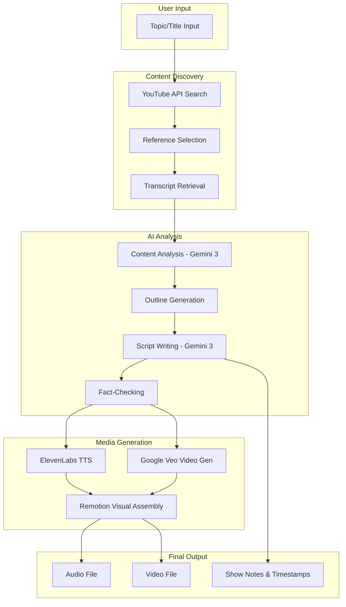

# AI Podcast Generator

> Gemini AGI Hackathon - December 2025

An AI-powered system that generates complete podcast episodes from a topic prompt, leveraging Google Gemini 3 for content creation, ElevenLabs for natural voice synthesis, and Google Veo for cinematic video generation.

## System Architecture



## Technology Stack

| Component | Technology |
|-----------|------------|
| Content Discovery | YouTube Data API |
| AI Processing | Google Gemini 3 |
| Text-to-Speech | ElevenLabs API |
| Video Generation | Google Veo (Vertex AI / VideoFX) |
| Video Assembly | Remotion (React) |

---

## System Workflow

The end-to-end workflow is composed of several modules, each responsible for part of the process. Below is a high-level breakdown of the steps involved in producing a podcast episode from a topic prompt.

### 1. Topic Input & Podcast Discovery

The user enters a topic or title for the desired podcast episode. The system uses the **YouTube API** (limited to English results) to search for existing podcast episodes related to that topic. This yields a list of relevant YouTube videos (podcast recordings) that can serve as reference material.

**⚡ Performance Enhancement**: The system implements **persistent file-based caching** that stores search results and transcripts on disk. This cache survives server restarts and provides 40-60x faster response times for repeated queries. See [CACHE_SYSTEM.md](./CACHE_SYSTEM.md) for details.

### 2. Reference Selection

The user is presented with the top search results – e.g., popular or relevant podcast episodes on the topic – and can select a few of these as references. Using YouTube ensures easily accessible content; we restrict to YouTube-only sources per the requirements.

### 3. Transcription Retrieval

For each selected YouTube podcast, the system obtains the transcript of the episode. We can use YouTube's caption data if available (the YouTube Data API provides caption tracks for videos) or rely on an open-source tool to fetch auto-generated subtitles. This yields raw text for what was discussed in each reference podcast.

### 4. Content Analysis

The transcripts are analyzed by the AI (**Gemini 3**) to extract key discussion points, themes, and interesting anecdotes. The AI reads through the transcripts and summarizes the main topics covered and any notable stories or facts mentioned. This might involve prompting Gemini to list major themes or using keyword extraction techniques. The analysis helps identify what content from the references could inform our new episode.

### 5. Outline Generation

Using the insights from the analysis, the system (or the user with AI assistance) formulates an outline for the new podcast episode. The outline is a structured list of segments or topics to cover, potentially including:
- Introduction
- Key subtopics
- Conclusion

Gemini can aid this step by proposing a draft outline that covers the important points and flows logically. Partial human input is valuable here – the user can tweak or approve the outline to ensure it aligns with their vision.

### 6. Script Writing with Gemini 3

Given the approved outline, **Gemini 3** is invoked to write the full podcast script. This is where the advanced reasoning and narrative skills of Gemini shine. The model generates a conversational script that expands on each outline point, writing it in the style of podcast dialogue or monologue as appropriate.

We can prompt Gemini to include engaging elements like:
- A friendly intro
- Smooth transitions between topics
- Banter or Q&A for multi-speaker format

The result is a draft script that reads like a real podcast episode, with a natural flow and pacing.

### 7. Fact-Checking (Optional)

Since the script may incorporate facts or claims from the reference podcasts, it's important to verify accuracy. This could be a semi-automated step:
- Using the LLM to double-check certain factual statements against a knowledge base
- Verifying via a web search API
- Human review of factual statements

This step ensures the final content is trustworthy and not just parroting potential inaccuracies from the sources.

### 8. Text-to-Speech Conversion

Once the script is finalized, the **ElevenLabs API** is used to convert it to speech. ElevenLabs offers extremely natural-sounding voices that are nearly indistinguishable from real human hosts.

The process:
1. Send the script text (possibly broken into segments) to the ElevenLabs TTS endpoint
2. Receive audio files (MP3 or WAV) for each segment or the whole script
3. Choose single narrator or multiple voices for dialog feel

ElevenLabs supports custom voice cloning, but built-in high-quality voices work well. The result is a podcast audio track with realistic narration.

### 9. Video Generation with Google Veo

This component utilizes **Google Veo** (via Vertex AI or VideoFX) to generate high-definition, cinematic video clips that visually represent the script's narrative. This creates "scroll-stopping" content indistinguishable from high-budget production.

#### Scene Segmentation & Prompting
The system uses an LLM (Gemini) to analyze the script and break it down into distinct visual "scenes" (approximately 5 seconds each). The LLM generates specific text-to-video prompts for each scene to ensure visual consistency (e.g., "Cinematic lighting, photorealistic 4K, vertical 9:16 aspect ratio").

#### Veo Video Generation
These prompts are sent to the Google Veo model. Veo generates coherent, high-quality video clips for each segment. Unlike standard stock footage, these visuals are custom-generated to match specific keywords in your script (e.g., if the script mentions "neural networks," Veo generates a specific, abstract visualization of glowing nodes).

### 10. Visual Slide/Video Generation with Remotion

With audio ready, **Remotion** (or a similar programmatic video tool) generates synchronized video consisting of slides or simple animations aligned to the audio timeline.

#### Slide Content
- AI-generated short text highlights or titles for each section
- Text overlays or bullet lists on the video
- Images or graphics related to the topic
- Optional: Use image search API, stock library, or image generation model

#### Using Remotion
Remotion allows defining React components for each scene/slide and programmatically rendering a video file:
- Create components like `<IntroScene>`, `<TopicSlide>`, `<OutroScene>`
- Each component displays text and images timed to the audio
- Audio track from ElevenLabs added as a layer for synchronization
- Transitions occur at segment boundaries

#### Automation with AI
Gemini's function-calling can output structured JSON or code instructions describing the sequence of slides (what text/image to show at what time). The app interprets that and constructs the video. A template-based approach works well (static background, dynamic text for titles, waveform animation for audio).

### 11. Show Notes & Timestamps

In parallel with media generation, **Gemini 3** produces the show notes. The show notes typically include:
- Summary of the episode
- Breakdown of topics discussed with timestamps

Example format:
```
00:00 – Introduction
01:30 – Topic A (description)
05:20 – Story about XYZ
10:00 – Conclusion
```

We prompt Gemini to summarize each segment in one sentence and prepend the correct timestamp. The result is ready-to-publish show notes that improve listener experience and SEO.

### 12. Final Assembly & Delivery

The final outputs are:
- **Audio file** (MP3/WAV)
- **Video file** (MP4)
- **Show notes** (Text/Markdown)

For the demo:
- Allow user to play audio/video in the web app
- Provide download options for files
- Optional: Auto-upload to YouTube as unlisted video with show notes as description

---

## Module Summary

| Module | Description | Input | Output |
|--------|-------------|-------|--------|
| Topic Discovery | Search YouTube for related podcasts | Topic string | List of YouTube videos |
| Reference Selection | User picks reference episodes | Video list | Selected videos |
| Transcription | Extract transcripts from videos | Video IDs | Raw transcripts |
| Content Analysis | Extract themes and key points | Transcripts | Analysis summary |
| Outline Generation | Create episode structure | Analysis | Episode outline |
| Script Writing | Generate full podcast script | Outline | Complete script |
| Fact-Checking | Verify claims and facts | Script | Verified script |
| TTS Conversion | Convert script to speech | Script | Audio files |
| Veo Video Gen | Generate cinematic clips | Script segments | Video clips |
| Remotion Assembly | Create synchronized video | Audio + visuals | Final video |
| Show Notes | Generate timestamps and summary | Script + timing | Show notes text |
| Final Delivery | Package and present outputs | All assets | Downloadable files |

---

## Getting Started

### Quick Start

See [QUICKSTART.md](QUICKSTART.md) for 5-minute setup guide.

### Detailed Setup

See [SETUP.md](SETUP.md) for comprehensive installation instructions.

### Testing

See [TESTING.md](TESTING.md) for manual and automated testing guides.

### Project Overview

See [PROJECT_SUMMARY.md](PROJECT_SUMMARY.md) for complete implementation details.

## API Keys Required

- **YouTube Data API** - For searching and retrieving podcast content
- **Google Gemini API** - For content analysis and script generation
- **ElevenLabs API** - For text-to-speech conversion

Get your API keys:
- [YouTube Data API](https://console.cloud.google.com/)
- [Google Gemini](https://makersuite.google.com/app/apikey)
- [ElevenLabs](https://elevenlabs.io/)

## Implementation Status

✅ **Completed Features:**
- Topic Input & YouTube Discovery
- Reference Selection UI
- Transcript Retrieval
- Content Analysis (Gemini)
- Outline Generation
- Script Writing (Single & Multi-host)
- Text-to-Speech Conversion (ElevenLabs)
- Complete Frontend Wizard
- Audio Playback & Download

🚧 **Future Enhancements:**
- Video Generation (Google Veo)
- Visual Assembly (Remotion)
- Show Notes Generation
- Fact-Checking Module
- User Authentication

## Tech Stack

**Backend:**
- FastAPI (Python 3.11+)
- Google Gemini 3
- YouTube Data API
- ElevenLabs API

**Frontend:**
- Next.js 14
- TypeScript
- TailwindCSS + shadcn/ui

## License

MIT License - Built for Gemini AGI Hackathon December 2025
